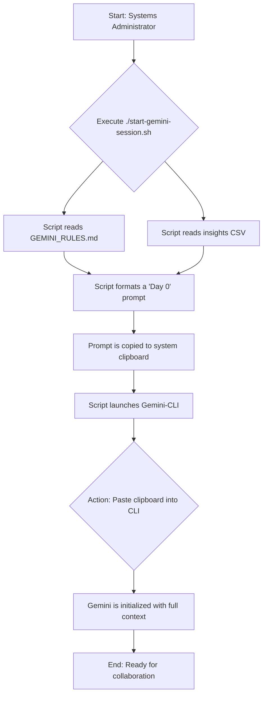
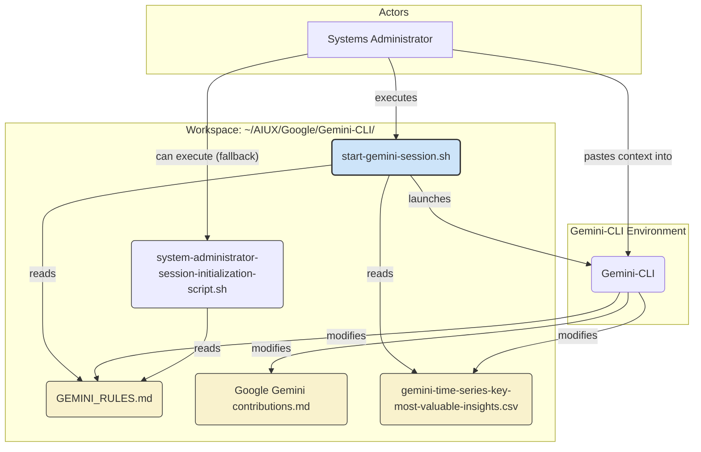

# Gemini Workspace Diagrams

This file contains Mermaid diagrams to visualize the workflow and architecture of our collaborative environment on the Yaberechiah system.

## Session Initialization Flowchart

This diagram illustrates the step-by-step process for starting a new, context-aware Gemini session using the `start-gemini-session.sh` launcher.

## System Components Diagram

This diagram shows the key files in our workspace and how they relate to each other and to the core Gemini-CLI tool.

